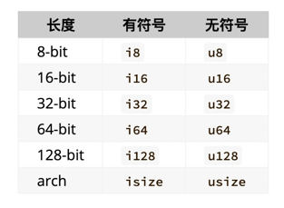

# 变量与可变性
rust变量默认不可变
可以通过声明为mut为可变。

## 常量
- 常量声明方式：const并指明数据类型
- 常量不可声明为mut方式
- 不可将运行时计算的数据返回给常量，比如函数返回值
- 常量可以在全局中使用

## 隐藏
使用let声明同名的变量可以覆盖之前的变量
在覆盖的同时可以修改变量的数据类型

# 数据类型
rust是静态类型语言：在编译期就要确定数据类型。
```rust
let num: i32 = x.parse().expect("Not number");
```
上面例子需要指明类型。

parse函数会返回Result类型的数据，使用expect方法可以进行解构，如果返回值Ok，则直接返回数据；
如果Error，会产生含有expect声明的字符串的panic。

## 标量类型
### 整数
rust默认i32。




对于arch长度的，64位机器会是64bit长度，32位机器会是32bit长度。一般用在集合的索引上。如访问数组下标。

对于整型字面量，可以在数值后标注类型；对于byte字面量，在前面标注。还可以使用_分隔符作为区分。如66u8，1_000i32，b’A’

溢出：在debug模式下会发生panic；release模式会出现“环绕”现象（u8: 0, 1 … 255, 0, 1）。
如果需要环绕，可以使用Wrapping。
```rust
let wrap = Wrapping(200u8);
let wrap2 = Wrapping(56u8);
println!("warp is : {}", (wrap + wrap2).0);
```

### 浮点数

默认f64。包含f32和f64。分别占用32位和64位。
### 布尔
true或者false，占用1B。

### 字符类型
rust字符类型占用4B。是个Unicode。表示范围更广，可以表示emoji表情(‘😄’)。使用单引号引用。

## 复合类型
### 元组
- 长度不可动态调整
- 可以放置不同类型的元素
- 可以解构
- 可以通过下标方式访问
### 数组
- 长度不可动态调整（在栈上分配空间）
- 只能放置相同类型的元素
- 动态数组vector在堆上分配空间，可以动态调整大小

#函数
rust会区分函数和方法的概念。方法一般是定义在struct、enum中的函数。
## 参数
定义函数时的参数变量被称为parameter，传入函数时的具体数据叫做argument。rust对于有参数的函数，需要为参数明确指定类型。

## 语句与表达式
语句一般以分号结尾；表达式（不以分号结尾）是语句的一部分。

## 返回值
返回值需要明确指定类型。可以用return从函数的中间部分直接返回；也可以用最后一个表达式返回。

#控制流
##IF表达式
if后必须是返回bool类型的表达式（就像java一样）。
if是一个表达式。

##循环
###loop
loop可以返回执行某一块代码，直到被终止。终止方式：ctrl + c或者break。
break可以在后面跟一个表达式，作为loop循环的返回值。

###while
没有do while

###for
可以方便的遍历数组等其他集合类型。
rust还支持Range。
```rust
fn for_range_test() {
    for number in (1..5).rev() {
        println!("{}", number);
    }
}
```
