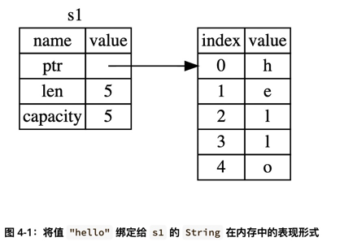

# 什么是所有权
## 堆栈
在栈上分配的内存空间需要是已知且固定的大小。
栈上的内存空间一般更紧凑，方便使用OS的局部性原理。
栈上数据的访问更高效，因为要访问的数据就在栈顶。

在堆上，可以分配大小不固定的内存。

## 内存与分配
在C语言中需要malloc或者free进行手动内存的分配与释放。

对于java语言，可以通过GC的方式进行垃圾回收。

在rust中，使用了新的方案：根据所有权与作用域进行内存管理。

```rust
    fn mem_malloc_test() {
        let s1 = String::from("hello");
        println!("before: {}", s1);
    } // s离开作用后直接被释放
```
内存模型如下：



上图中，s1分配在栈上，真实数据存储在堆上。
主要包括3部分内容：一个指向真实数据的指针，一个真实数据长度，一个从操作系统申请的空间大小。

如果存在变量重新赋值：
```rust

    #[test]
    fn mem_malloc_test() {
        let s1 = String::from("hello");
        println!("before: {}", s1);

        let s2 = s;

        println!("after: {}", s1);
    }
```

此时，有两个指针指向了同一块堆内存。内存模型图如下：


上面的代码，s1和s2同时离开了作用域，会被释放2次。会造成重复释放的问题（比如，由于并发问题，
s1刚释放了内存，其他线程立马分配了这段内存，那么s2再次释放内存，导致另外一个线程执行出错）。

```c
#include <stdlib.h>
#include <string.h>
#include <stdio.h>

struct str {
  char *p;
  int len;
  void (*destructor)();
};

void str_destructor(struct str *s) {
  free(s->p);
}

struct str *new_str(const char *s) {
  struct str *_s = malloc(sizeof(struct str));
  _s->len = strlen(s);
  _s->p = malloc(strlen(s) + 1);
  _s->destructor = str_destructor;
  strcpy(_s->p, s);
  return _s;
}

struct str from(const char *s) {
  char * p = malloc(strlen(s) + 1);
  strcpy(p, s);
  struct str _s =  {
    .len = strlen(s),
    .p = p,
    .destructor = str_destructor
  };

  return _s;
}

void free_str(struct str *s) {
   s->destructor(s);
   free(s);
}

int main() {
  struct str stacks = from("1234");

  struct str stacks2 = stacks;

 // struct str *heaps = new_str("1234");
 // printf("%s\n", stacks.p);
 // printf("%s\n", heaps->p);
 // free(heaps);

  stacks2.destructor(&stacks2);
  stacks.destructor(&stacks);
}

```

rust的String，其len和capacity是在栈上分配的。而java的String的len和capacity是在堆上存储的。从上面的C语言代码，其中stacks变量
演示的是rust实现方式；heaps指针演示的是java的实现方式。


rust为避免上面的问题，同时为了避免复制真实数据，rust直接标记s1为废弃状态。所以，上面的代码会发生编译错误：
`borrow of moved value: `s1``。在rust中，这种叫做移动(move)。
这样，由于s1已经被废弃，只有s2可用，那么在离开作用域后，真实内存只会被释放一次。

上面的介绍其实就是浅拷贝。

## clone
为了能够实现深拷贝，可以使用clone方式。

```rust

    #[test]
    fn clone_test() {
        let s1 = String::from("hello");
        println!("before s1: {}", s1);

        let s2 = s1.clone();
        println!("after, s1: {}, s2: {}", s1, s2);
    }
```


## 栈上数据复制

```rust

    #[test]
    fn stack_test() {
        let x = 2;
        let y = x;
        println!("x: {}, y: {}", x, y);
    }
```
上面的代码没有问题。

==rust提供了Copy trait，来实现赋值操作保持可用性。但是如果这种类型或者这种类型的任一成员实现了Drop trait，
那么rust不允许这种类型实现Copy trait。==  

在栈上分配数据开销很小，所以整型、浮点型、bool型、char、元组元素都是Copy的，可以直接复制。

## 函数参数与返回值
函数参数与返回值遵循"移动"原则。

如果不想"移动来移动去"，可以使用"引用"。

# 引用与借用

可以使用引用的方式，不获取所有权，而只是使用权，在rust中，这叫借用（borrowing）。

- 不可同时存在多个对同一变量的可变引用
- 不可同时存在对同一变量的可变引用和不可变引用
- 可以同时存在对同一变量的不可变引用

# 悬垂引用

返回了"离开作用域后不再有效"的变量引用。

## 生命周期

当返回引用时，如果返回的引用指向的是在函数内创建的变量，会造成悬垂引用。

如果返回的是传入的参数引用，那么需要指定生命周期。

引入生命周期的目的是：保证所有的引用都是安全的。

# 切片

引用集合中某个连续的元素序列，但是不支持有整个集合的所有权。

```rust
    let s = String::from("hello world");

    let hello = &s[0..5];
    let world = &s[6..11];
```


## 字符串切片
字符串切片类型&str。

字符串字面量就是字符串切片。字符串字面量存储在二进制文件的特定位置的切片。
